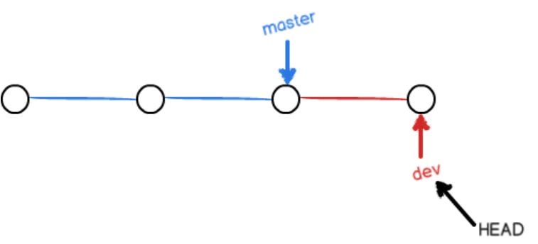

###创建版本库
（1）创建空目录，mkdir 文件名，cd 文件名，pwd（pwd命令用于显示当前目录）。
（2）`git init` 命令把这个目录变成Git可以管理的仓库
（3）创建一个文件将文件放在仓库目录下
（4）`git add` 文件名 ，把文件添加到仓库，（将文件修改添加到暂存区）
（5）`git commit -m "本次提交的说明（方便找到修改的记录）"`，（将暂存区所有内容提交到当前分支）
（6）`git status` 命令，查看修改的结果。
（7）`git diff` 命令，查看修改内容。
```
$git diff git.md 
```
（8）`git log` 命令显示从最近到最远的提交日志。加上--pretty=oneline参数。
```
$ git log --pretty=oneline
72d062405ff56b2a9a078296cf5158ab0c991796 (HEAD -> master) I lost something
8b5a46c114041eed81ac04505ee9c508cf47c427 merge dev with -no-ff

72d062405...是commit id（版本号）
```
（9）`git reset --hard HEAD^` 命令，HEAD（是一个指针）表示当前版本，HEAD^表示上一个版本。也可以找到未来的版本的commit id ，就可以回到指定的某个版本。
```
$git reset --hard 72d062405
回退到版本号为....的版本库
```
（10）`cat` 文件名 命令，查看文件内容。
（11）`git reflog` 命令，记录每一次命令。
```
$ git reflog
9a26f6e (HEAD -> master) HEAD@{0}: reset: moving to 9a26f6e927
72d0624 HEAD@{1}: reset: moving to HEAD^
9a26f6e (HEAD -> master) HEAD@{2}: reset: moving to 9a26f6e927
72d0624 HEAD@{3}: reset: moving to HEAD^
```
2、工作区（Working Directory），一个设置为仓库的文件夹就是一个工作区。
3、版本仓库（Repository），工作区中，一个隐藏目录.git，是Git的版本库。存储stage（暂存区），Git自动创建的第一个分支master，以及指向master的一个指针HEAD。
 
4、Git管理的是修改，每次修改的内容，先添加（add）到暂存区（stage）中，再提交（commit）。
（2）`git diff HEAD -- git.md`查看工作区和版本库最新版本的差别
5、`git checkout -- 文件名`，将文件在工作区的修改全部撤销。
（1）如果文件修改后没有放到暂存区，撤销后，就回到版本库的状态
（2）如果文件修改后添加到暂存区后，又做了修改，就回到添加暂存区后的状态。
（3）`git reset HEAD git.md`可以将暂存区的修改撤销，重新放回工作区。
6、rm 文件名 命令，将没用文件删了，使用该命令后使工作区和版本库不一致。
（2）`git rm` 文件名 命令，将文件从版本库中删除，并`git commit`。当在工作区中删错了，使用`git checkout -- 文件名`使用版本库的文件替换工作区的文件.
---
###远程仓库
（1）创建SSH Key，在.ssh目录（id_rsa和id_rsa.pub两个文件）
（2）登录Github，打开"Settings"->"SSH Keys"->"Add SSH Key"，在文本框中粘贴id_rsa.pub文件的内容。
1、`ssh-keygen -t rsa -C “youremail@example.com”`，创建SSH Key。
2、`git remote add origin https://github.com/sunyou-19/world.git`  命令将工作区与远程仓库连接，origin为远程库的名字。在Github上创建一个仓库，使用该命令，将本地仓库与之关联。
3、`git push -u origin master` 将本地库的所有内容推送到远程库上。
4、`git remote -v`查看远程库信息，`git remote rm origin` 删除远程库origin。
4、`git clone https://github.com/sunyou-19/world.git` 命令，克隆一个本地库。使用https速度慢，每次推送必须输入口令。还可以使用`git@github.com:sunyou-19/world.git` 地址。不同的协议。

---
###分支管理


（1）主分支为master分支，HEAD指向master，master指向提交(commit)。


1、创建分支，例如dev，git创建了一个指针名为dev，指向master相同的提交，再将HEAD指向dev，表示当前分支在dev上。

2、提交一次dev指针向前移动一步

3、将dev合并到mater上，将master指向dev的当前提交

4、合并分支后，可以删除分支

5、
（1） `git checkout -b dev` 命令，创建dev分支，然后切换到dev分支。
（2） `git branch dev` 命令，创建dev分支。`git branch` 命令查看当前分支。
（3） `git checkout dev` 命令，切换到dev分支。
（4） `git checkout master` 分支工作完成后，切换master。
（5） `git merge dev` 命令，将dev分支工作合并到master。
（6） `git branch -d dev` 命令，删除dev分支。
6、 `git switch -c 分支名` 命令，创建并切换分支。
7、当在一个分支修改后，提交到暂存区，切换到master分支，修改同样的文件，并提交到暂存区，当两个分支合并时发生冲突。
8、查看文件的内容，对冲突的部分进行修改，提交。
9、`git merge --no-ff -m “merge with no-ff” dev` 命令，表示禁用Fast Forward模式，不会删除分支。
10、
（1）`git stash` 命令，将当前工作现场储藏起来，等以后恢复现场后继续工作。
（2）`git stash list` 命令，查看工作现场。
（3）`git stash apply` 命令，将工作现场恢复后，stash内容并不删除，`git stash drop`来删除。
（4）`git stash pop` 命令，恢复的同时，也将stash内容删除。
11、当在一个分支上修复bug后，将该bug的操作“复制”到dev分支上，git branch命令查看分支。`git cherry-pick` 操作号 命令，复制一个特定的提交到当前分支。
12、`git branch -D` 分支名 命令，使用大写-D参数，强行删除。
13、`git remote` 查看远程仓库的信息，-v参数显示更详细的信息。
14、
（1）`git push` 远程仓库名 分支名 命令，将本地分支推送到远程仓库
（2）如果推送失败，则远程分支比本地更新，需要git pull试图合并
（3）如果合并有冲突，则解决冲突，并在本地提交。
（4）`git checkout -b branch-name origin/branch-name` ，在本地创建和远程分支对应的分支，本地和远程分支的名称最好一致。
（5）`git branch --set-upstream branch-name origin/branch-name`，建立本地分支和远程分支的关联。
15、`git log --graph --pretty=oneline --abbrev-commit` 命令，查看分支
16、`git rebase` 命令，将分支基于一个修改后的操作，将分支的操作变成一条直线。
17、
（1）`git tag <name>`在一个标签中打上一个标签。
（2）`git show <name>`查看标签信息。标签和commit挂钩。
（3）命令`git push origin <tagname>`可以推送一个本地标签；
（4）命令`git push origin --tags`可以推送全部未推送过的本地标签；
（5）命令`git tag -d <tagname>`可以删除一个本地标签；
（6）命令`git push origin :refs/tags/<tagname>`可以删除一个远程标签。
