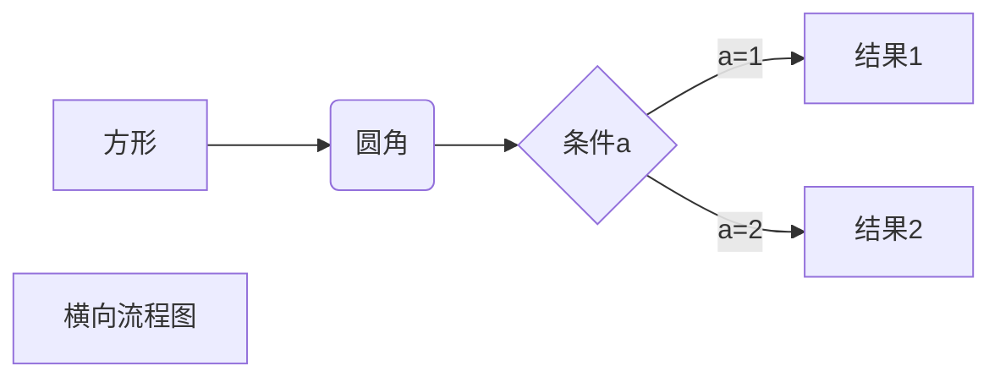
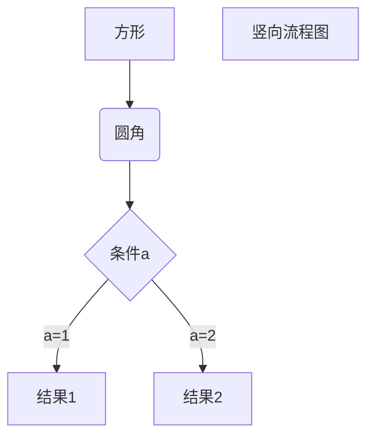
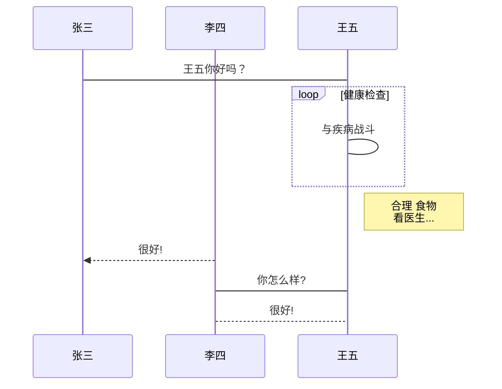

# Hello world

ctrl + K , V 预览

# 一级标题

## 二级标题

### 三级标题

#### 四级标题

##### 五级标题

###### 六级标题

每写完一个段落要隔一行空行.

就像这样, 隔了一行空行.

---

分割线

**重点加粗**

*斜体*

***粗斜体***

<u>下划线</u>

我是黑暗的野外[^脚注]
[^脚注]:你好

~~删除线~~

---

列表:

* 无序列表
  * 嵌套无序列表
    * 你好
  * 嵌套无序列表
* 无序列表
* 无序列表

1. 有序列表 1
   1. 嵌套有序列表 1
   2. 嵌套有序列表 2
2. 有序列表 2
3. 有序列表 3

---

引用文本:

> 引用别人说的话
>> 就这样写，第二层嵌套
>>> By. OrangeX4，第三层嵌套

---

这是 `行内代码` 语法.

代码块语法:

``` python
print("Hello, World!")
char *message = "Hello"
```

```C++
int main()
```

请将 ' 替换成 `.

---

[世界](https://orangex4.cool/post/notes-in-markdown/#%E7%AC%AC%E4%B8%80%E4%B8%AA-markdown-%E6%96%87%E4%BB%B6-hello-world)


### 高级链接
这是 1 一个链接 [Google][1]

[1]: http://www.google.com/


---

表格:

| 表头 | 表头 |表头|
| ---- | ----|----|
| 内容 | 内容 |    |
| 内容 | 内容 |    |

| 左对齐 | 右对齐 |居中对齐|
|:---- | ----:|:----:|
| 内容 | 内容 |  你好  |
| 内容 | 内容 |   是你们 |

:|   :) :(  :*
:$   :o :s  :z
:/   :P :D  






```flow
st=>start: 开始框
op=>operation: 处理框
cond=>condition: 判断框(是或否?)
sub1=>subroutine: 子流程
io=>inputoutput: 输入输出框
e=>end: 结束框
st->op->cond
cond(yes)->io->e
cond(no)->sub1(right)->op
```

```sequence
客户A->服务器B: SYN（请求）
Note right of 服务器B: 对象B的描述
Note left of 客户A: 对象A的描述(提示)
服务器B-->客户A: SYN ACK(响应)
客户A->服务器B: ACK(回答)
```




---
---
注释:

<!-- 你看不见我 -->

紧贴 $a\!b$

没有空格 $ab$

小空格 $a\,b$

中等空格 $a\;b$

大空格 $a\ b$

quad 空格 $a\quad b$

两个 quad 空格 $a\qquad b$

上标 $x^2 + y^{12} = 1$

下标 $x_1 + y_{12} = 1$

较小的行内行分数 $\frac{1}{2}$

展示型的分式 $\displaystyle\frac{x+1}{x-1}$

开平方 $\sqrt{2}$

开 $n$ 次方 $\sqrt[n]{2}$

累加 $\sum_{k=1}^n\frac{1}{k}  \quad  \displaystyle\sum_{k=1}^n\frac{1}{k}$

累乘 $\prod_{k=1}^n\frac{1}{k}  \quad  \displaystyle\prod_{k=1}^n\frac{1}{k}$

积分 $\displaystyle \int_0^1x{\rm d}x  \quad  \iint_{D_{xy}}  \quad  \iiint_{\Omega_{xyz}}$

圆括号 $\displaystyle \left(\sum_{k=1}^{n}\frac{1}{k} \right)^2$

方括号 $\displaystyle \left[\sum_{k=1}^{n}\frac{1}{k} \right]^2$

花括号 $\displaystyle \left\{\sum_{k=1}^{n}\frac{1}{k} \right\}^2$

尖括号 $\displaystyle \left\langle\sum_{k=1}^{n}\frac{1}{k} \right\rangle^2$

居中:

$$
\begin{aligned}
y &=(x+5)^2-(x+1)^2 \\
&=(x^2+10x+25)-(x^2+2x+1) \\
&=8x+24 \\
\end{aligned}
$$

左对齐:

$
\begin{aligned}
y &=(x+5)^2-(x+1)^2 \\
&=(x^2+10x+25)-(x^2+2x+1) \\
&=8x+24 \\
\end{aligned}
$

$$
\begin{cases}
k_{11}x_1+k_{12}x_2+\cdots+k_{1n}x_n=b_1 \\
k_{21}x_1+k_{22}x_2+\cdots+k_{2n}x_n=b_2 \\
\cdots \\
k_{n1}x_1+k_{n2}x_2+\cdots+k_{nn}x_n=b_n \\
\end{cases}
$$

矩阵:

$$
\begin{pmatrix}
1 & 1 & \cdots & 1 \\
1 & 1 & \cdots & 1 \\
\vdots & \vdots & \ddots & \vdots \\
1 & 1 & \cdots & 1 \\
\end{pmatrix}
$$

\quad
$$
\begin{bmatrix}
1 & 1 & \cdots & 1 \\
1 & 1 & \cdots & 1 \\
\vdots & \vdots & \ddots & \vdots \\
1 & 1 & \cdots & 1 \\
\end{bmatrix}
$$ 

行列式: 

$$
\begin{vmatrix}
1 & 1 & \cdots & 1 \\
1 & 1 & \cdots & 1 \\
\vdots & \vdots & \ddots & \vdots \\
1 & 1 & \cdots & 1 \\
\end{vmatrix}
$$

$$
x+2 \tag{1.2}
$$

$$
\begin{equation}
x^n+y^n=z^n
\end{equation}
$$

由公式 $(1.2)$ 可得到结论

点乘 $\cdot$, 叉乘 $\times$, 异或 $\otimes$, 直和 $\oplus$, 加减 $\pm$, 复合 $\circ$.
小于等于 $\leq$, 大于等于 $\geq$, 不等 $\neq$, 恒等 $\equiv$, 约等 $\approx$, 等价 $\cong$, 相似 $\sim$, 相似等于 $\simeq$, 点等 $\doteq$.
逻辑与 $\land$, 逻辑或 $\lor$, 逻辑非 $\lnot$, 蕴涵 $\to$, 等价 $\leftrightarrow$.
因为 $\because$, 所以 $\therefore$, 存在 $\exist$, 任意 $\forall$.
左小箭头 $\leftarrow$, 右小箭头 $\rightarrow$, 左大箭头 $\Leftarrow$, 右大箭头 $\Rightarrow$, 右长箭头 $\xrightarrow[fgh]{abcde}$.
属于 $\in$, 包含于 $\subset$, 真包含于 $\subseteq$, 交 $\cap$, 并 $\cup$, 空集 $\empty$
短向量 $\vec{x}$, 长向量 $\overrightarrow{AB}$, 上横线 $\overline{p}$.
无限 $\infty$, 极限 $\lim$, 微分 ${\rm d}$, 偏导 $\partial$, 点求导 $\dot{y}$, 点二阶导 $\ddot{y}$, 变化量 $\Delta$, 梯度 $\nabla$.
横省略 $\cdots$, 竖省略 $\vdots$, 斜省略 $\ddots$.
常见函数 $\sin$, $\cos$, $\tan$, $\arcsin$, $\arccos$, $\arctan$, $\ln$, $\log$, $\exp$.

通用操作
Ctrl + C, 复制当前文本
Ctrl + V, 粘贴当前文本
Ctrl + Z, 撤销
Ctrl + Shift + Z, 反撤销
Shift + Alt + F, 整理代码
Ctrl + /, 将当前行注释 / 反注释, 当多行文本被选中时, 将多行文本注释
光标操作
Ctrl + ← 将光标向左移动一个单词
Ctrl + → 将光标向右移动一个单词
Ctrl + Alt + ↑, 向上加入一个光标
Ctrl + Alt + ↓, 向下加入一个光标
Ctrl + Alt + U, 撤销上次光标操作
界面移动
Ctrl + ↑ 向上移动当前界面
Ctrl + → 向下移动当前界面
选中操作
Shift + ← 向左选中 / 反选中一个字符 (重要)
Shift + → 向右选中 / 反选中一个字符 (重要)
Ctrl + Shift + ← 向左选中 / 反选中一个单词 (重要)
Ctrl + Shift + → 向右选中 / 反选中一个单词 (重要)
Ctrl + D 当前有选中文本时, 将下一个与其相同的文本加入选中 (重要)
文本行操作
Ctrl + C 当前无选中文本时, 复制当前行
Shift + Alt + ↑ 向上复制当前行, 当多行文本被选中时, 向上复制多行 (重要)
Shift + Alt + ↓ 向下复制当前行, 当多行文本被选中时, 向下复制多行 (重要)
Alt + ↑ 向上移动当前行, 当多行文本被选中时, 将当前多行文本向上移动 (重要)
Alt + ↓ 向下移动当前行, 当多行文本被选中时, 将当前多行文本向下移动 (重要)
